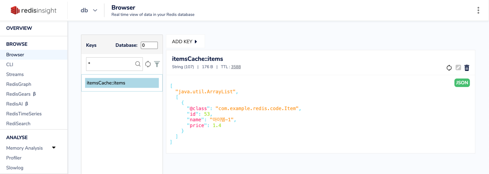

# springboot-kafka-demo

이 프로젝트는 Spring Boot와 Redis를 사용하여 캐시 환경을 구축하는 예제 프로젝트입니다.

Look Aside + Write Around [캐시 전략](https://inpa.tistory.com/entry/REDIS-%F0%9F%93%9A-%EC%BA%90%EC%8B%9CCache-%EC%84%A4%EA%B3%84-%EC%A0%84%EB%9E%B5-%EC%A7%80%EC%B9%A8-%EC%B4%9D%EC%A0%95%EB%A6%AC)을 활용하여 아이템(Item) 데이터를 캐시하며,  캐시된 데이터는 redisinsight를 통해 시각적으로 파악할 수 있습니다.

Spring Boot 3.1부터 추가된 spring-boot-docker-compose 의존성을 추가하여 MySQL, Redis, redisinsight 인프라 환경을 구축했습니다.

## Run

### 1. 애플리케이션 실행
```shell
./gradlew bootRun

or 

./gradlew build
java -jar build/libs/spring-redis-cache.jar
```

### 2. 아이템 생성/조회/삭제
```shell
# 생성
POST /api/items HTTP/1.1
Host: localhost:8081
Content-Type: application/json

{
    "name": "아이템-1",
    "price": 1.0
}

# 조회 - 단건
GET /api/items/1 HTTP/1.1
Host: localhost:8081

# 조회 - 다건
GET /api/items HTTP/1.1
Host: localhost:8081

# 삭제
DELETE /api/items/1 HTTP/1.1
Host: localhost:8081
```


```java
# Service 레이어

/**
 * 아이템 리스트 조회 (items 캐시)
 */
@Cacheable(value = "itemsCache", key = "'items'")
public List<Item> findAll() {
    return itemJpaRepository.findAll();
}

/**
 * 아이템 조회 (item id로 캐시)
 */
@Cacheable(value = "itemsCache", key = "#id")
public Item findItemById(Long id) {
    return itemJpaRepository.findById(id).orElse(null);
}

/**
 * 아이템 저장 (item id로 캐시, items 캐시 삭제)
 */
@CachePut(value = "itemsCache", key = "#result.id")
@CacheEvict(value = "itemsCache", key = "'items'")
public Item save(ItemDto item) {
    var entity = new Item();
    entity.setName(item.getName());
    entity.setPrice(item.getPrice());

    return itemJpaRepository.save(entity);
}

/**
 * 아이템 삭제 (item id 삭제, items 캐시 삭제)
 */
@Caching(evict = {
        @CacheEvict(value = "itemsCache", key = "#id"),
        @CacheEvict(value = "itemsCache", key = "'items'")
})
public void deleteItem(Long id) {
    itemJpaRepository.deleteById(id);
}
```


### 3. 캐시 데이터 확인 (redisinsight)


redisinsight 사용 시 아래 링크 Step 6 참고

[redisInsight 연결](https://collabnix.com/running-redisinsight-using-docker-compose/)

## Reference
- https://velog.io/@hwsa1004/Spring-Redis-Cache%EB%A5%BC-%ED%86%B5%ED%95%B4-%EC%84%B1%EB%8A%A5-%EA%B0%9C%EC%84%A0%ED%95%98%EA%B8%B0
- https://collabnix.com/running-redisinsight-using-docker-compose/
- https://inpa.tistory.com/entry/REDIS-%F0%9F%93%9A-%EC%BA%90%EC%8B%9CCache-%EC%84%A4%EA%B3%84-%EC%A0%84%EB%9E%B5-%EC%A7%80%EC%B9%A8-%EC%B4%9D%EC%A0%95%EB%A6%AC